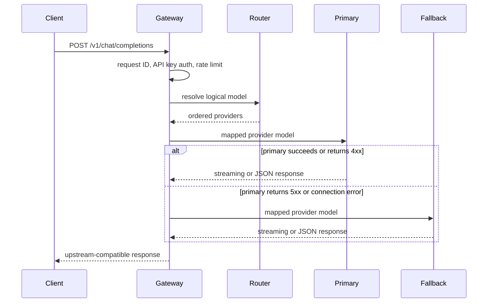

# Architecture

## Request path

## Design decisions

### Logical models

Clients request a stable logical model such as `smart-chat`. Routing configuration maps that model to
an ordered provider list and maps it again to each provider's physical model. Provider changes therefore
do not require client releases.

### Reactive proxy

Spring WebFlux keeps streaming responses non-blocking and avoids buffering complete model responses in
gateway memory. This matters for server-sent event token streams and slow upstream generations.

### Failure policy

Connection failures, timeouts, and upstream 5xx responses trigger the next configured provider. Upstream
4xx responses are forwarded because retrying invalid input or exhausted provider quota against every
provider can increase cost and hide the real error.

### Current limits

The first milestone uses an in-memory fixed-window limiter. It is intentionally isolated behind a filter
so a Redis-backed distributed limiter can replace it when multiple gateway instances are introduced.
