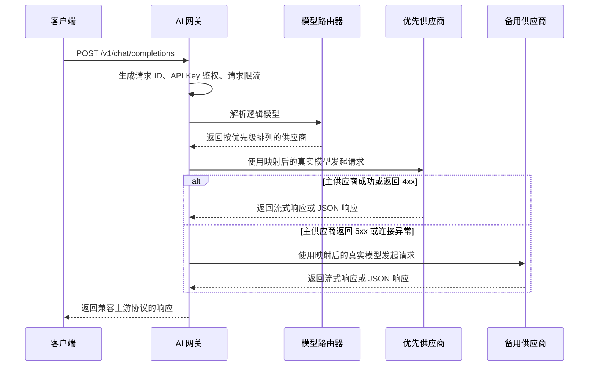

# 架构设计

## 请求链路



## 核心组件

### 请求过滤器

请求进入业务接口前，依次经过以下过滤器：

1. `RequestIdFilter`：接收客户端传入的 `x-request-id`，或生成新的请求 ID，并将其返回给客户端。
2. `ApiKeyFilter`：校验 Bearer Token 或 `x-api-key`，拒绝未授权的 `/v1/**` 请求。
3. `RateLimitFilter`：根据已验证的 API Key 执行固定时间窗口限流。

过滤器通过显式执行顺序保证先生成请求 ID，再完成鉴权，最后执行限流。因此鉴权失败和限流响应同样具备请求追踪标识。

### 模型路由器

客户端请求稳定的逻辑模型，例如 `smart-chat`。路由配置会将逻辑模型映射为按优先级排列的供应商列表，
并进一步映射为各供应商使用的真实模型名称。

```text
smart-chat
  -> DeepSeek / deepseek-v4-flash
  -> OpenAI / gpt-4o-mini
  -> Compatible / qwen2.5:7b
```

更换供应商或升级真实模型时，客户端无需修改模型名称或重新发布。

### 上游客户端

`UpstreamClient` 负责：

- 校验供应商配置和 API Key
- 将逻辑模型改写为供应商真实模型
- 调用 OpenAI-compatible Chat Completions API
- 使用 `Flux<DataBuffer>` 透传普通响应与 SSE 流式响应
- 记录供应商调用成功和失败指标

网关不会在内存中聚合完整的流式响应，可以降低长时间生成任务的内存占用。

## 失败处理策略

连接失败、请求超时和上游 `5xx` 响应会触发下一个已配置供应商。

上游 `4xx` 响应会直接返回客户端，不触发故障回退。因为 `4xx` 通常表示参数错误、权限不足或供应商配额耗尽，
对所有供应商重复发送相同请求可能增加调用成本，并掩盖真实错误。

当所有供应商均调用失败时：

- 客户端收到稳定的中文错误响应
- 英文错误码保持不变，方便程序判断
- 底层连接异常仅写入服务端日志，避免泄露内部信息

## 响应兼容性

网关当前对外提供：

- `POST /v1/chat/completions`
- `GET /v1/models`

上游响应的状态码、内容类型和响应体会尽量保持原样。当前仅转发必要的内容类型响应头，
避免将供应商内部或连接级响应头泄露给客户端。

## 可观测性

当前提供以下可观测能力：

- `x-request-id` 请求追踪标识
- 上游供应商成功与失败计数
- Spring Boot Actuator 健康检查
- Prometheus 指标端点

相关地址：

- 健康检查：`/actuator/health`
- Prometheus 指标：`/actuator/prometheus`

## 当前设计边界

当前限流器使用单机内存固定窗口。该实现适合单实例部署和功能验证，但多个网关实例之间无法共享计数。
后续可将限流存储替换为 Redis，实现分布式限流、租户配额和并发控制。

供应商、路由和客户端 API Key 当前来自配置文件。后续可以使用 MySQL 持久化配置，
并提供动态配置管理、审计记录和调用成本统计能力。
